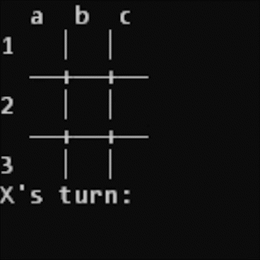
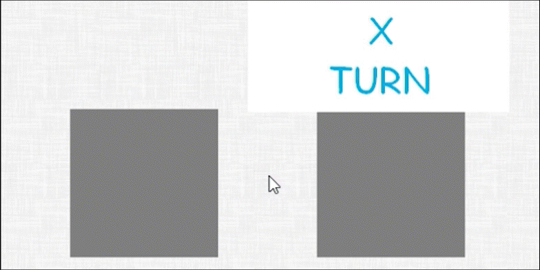

# Skrosses
Tic Tac Toe in Pygame

Requires Python and Pygame installed

## Command Line (CLI)
The current player's turn is displayed 
below the board as:

`X's turn` if it's X

`○'s turn` if it's ○

Use standard notion to place on an 
unoccupied space i.e. "a1"

 

#### Commands

`Resign` or `r`
Forfeits current game to the opponent

`Pass` or `p`
Skips current turn without placing
anything

`Help` or `h`
Displays help

`Exit`
Exits the game

`y` or `n` _(When Prompted)_
Selects the option provided by the prompt 

## Graphical (GUI)
Click on any of the grey squares to place a X or ○

 

The top will indicate who's turn it's currently or the winner if the game is over 

Press `R` to reset the board

To quit, press `Escape` or close the window 
